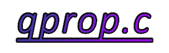

# qprop.c

<!---->
<p align="center">
    </img>
</p>

[🌐 Run in your browser](https://pavanandrea.github.io/qprop.c/webgui/index.html) &nbsp; &bullet; &nbsp;
[⇩ Download](https://github.com/pavanandrea/qprop.c/releases/latest) &nbsp; &bullet; &nbsp;
[✅ Validation](https://github.com/pavanandrea/qprop.c/tree/main/validation)

*qprop.c* is a simple, lightweight library for analyzing the aerodynamic
performance of propellers.
It uses the same mathematical formulation as Mark Drela's
[QPROP](https://web.mit.edu/drela/Public/web/qprop/),
which makes it well-suited for slender rotors that operate at low Reynolds
numbers and do not have strong tip vortices.

QPROP belongs to the family of Blade Element Methods (BEM).
Unlike traditional BEMT methods, which incorporate actuator disk theory,
QPROP utilizes vortex theory instead.
This approach offers several numerical advantages, such as avoiding the
infamous singularity at $\phi=0$, and provides more accurate results.

 | 
:------------------------------------------------------------------------:|:------------------------------------------------------------------------:
        | 


💡 Motivation
-------------

This project was created with the goal of building a minimal tool to quickly
estimate thrust and torque of drone propellers and that could be easily
integrated in conceptual design workflows and optimization algorithms.

The original QPROP is a great tool, but it is not designed to be used in this way.
It is a standalone program that requires some setup and manual effort to use.
In contrast, *qprop.c* is a plain C implementation in one single file
with no dependencies, making it easy to include in other projects.


✨ Key Features
---------------

- [x] **Lightweight and portable**: One file in pure C, no dependencies, no installations
- [x] **Easy to use**: simply copy the library into your own project directory
- [x] **No file I/O required**: perform analyses and retrieve results without
      writing input files or reading output files
- [x] **Accurate airfoil polars**: unlike the original QPROP, which requires
      users to tune oversimplified analytic models, *qprop.c* gets the aerodynamic
      coefficients of the airfoils by interpolating XFOIL polars
- [x] **Python and Julia support**: Bindings are included for both languages,
      maintaining native C performance <!--  **Python, Julia and MATLAB support**: Bindings are included for all three languages, maintaining native C performance -->
<!--- [x] **Cross-platform**: Runs on Windows, Mac and Linux operating systems
- [x] **Permissive licensing**: Released under the MIT License, allowing for
      free use, modification and distribution
- [x] **Secure and Up-to-Date**: Binaries are generated by GitHub Actions for maximum security and reliability-->


🚀 Getting Started
------------------

Download the latest release from the GitHub [releases page](https://github.com/pavanandrea/qprop.c/releases/latest).
The package is self‑contained - no extra installation steps are required.
After unpacking, you will find a set of example scripts to help you get started.

```
📚 qprop-portable-latest.zip/
├── 📄 LICENSE
├── 📂 qprop-portable/
│   ├── 📄 LICENSE
│   ├── 📄 qprop.h
│   ├── 📄 qprop.jl
│   ├── 📄 qprop.py
│   ├── ⚙️ qprop-lib-linux-x64.so
│   ├── ⚙️ qprop-lib-macos-arm64.dylib
│   ├── ⚙️ qprop-lib-windows-x64.dll
├── 📄 example_julia.jl
├── 📄 example_matlab.m
├── 📄 example_python.py
└── 📄 README.txt
```

For a quick start, consider the following Python snippet showing how to read airfoil data,
load a propeller model and compute thrust and torque:
```python
import math
import os
import sys
sys.path.insert("path/to/qprop-portable/")
import qprop

#read airfoil polars from a folder named "airfoil_polar_naca4412_Ncrit=6"
polar_filenames = sorted([
    os.path.join("path", "to", "airfoil_polar_naca4412_Ncrit=6", f) \
    for f in os.listdir("airfoil_polar_naca4412_Ncrit=6") \
    if f.endswith(".txt")
])
naca4412 = qprop.import_xfoil_polars(polar_filenames)

#import propeller geometry from file
apc10x7sf = qprop.import_rotor_geometry_apc(
    os.path.join("path", "to", "10x7SF-PERF.PE0"),
    naca4412
)

#calculate propeller performance using qprop.c
Uinf = 0.00                 #freestream velocity (m/s)
Ω = 6014*math.pi/30         #rotor speed (rad/s)
results = qprop.qprop(apc42x4, Uinf, Ω)
print("Thrust: ", round(results.T, 5), " N")
print("Torque: ", round(results.Q, 5), " N-m")
```

You can also explore the `validation` folder in this repo for further examples.


🛠️ Build from Source
--------------------

*qprop.c* is a self-contained, dependency-free C implementation in a single file.
Unlike many projects, it does not require a complex build pipeline.
To build *qprop.c*, simply compile the source file using your favourite C compiler.
Here's an example using GCC on Linux:

```bash
gcc qprop.c -o qprop-lib-linux-x64.so -shared -lm -fPIC -O2 -Wall -Wextra
```

The Zig compiler (`zig cc`) is recommended when cross-compilation is needed
(see `build/build.sh`).


📄 License
----------

While the mathematical formulation of *qprop.c* is the same as the original QPROP,
the implementation is written from scratch without looking at the original code.

This allows *qprop.c* to be released under the MIT License, allowing its use virtually
without restrictions. <!--For example, if you are developing a closed-source software,-->
<!--you can integrate and distribute *qprop.c* without sharing the source code.-->
See the `LICENSE` file for details.


🤔 Issues
---------

If you encounter any issues while using *qprop.c*, please open an issue ticket and
provide detailed information about the problem you are experiencing.

Any question, feedback or request you may have are also welcome.


📑 References
-------------

[1] M. Drela, "[QPROP theory document](https://web.mit.edu/drela/Public/web/qprop/)",
    MIT Aero & Astro, 2006, Online

[2] APC Propellers, "[Propeller Geometry Data](https://www.apcprop.com/technical-information/file-downloads/)",
    Online

[3] J.B. Brandt et al., "[UIUC Propeller Database](https://m-selig.ae.illinois.edu/props/propDB.html)",
    Volumes 1-4, University of Illinois at Urbana-Champaign, Department of Aerospace Engineering, Online

[4] S.A. Ning, "[A simple solution method for the blade element momentum equations with guaranteed convergence](https://doi.org/10.1002/we.1636)",
    Wind Energy, Volume 17, Issue 9, Pages 1327-1345, Wiley, 2014, DOI: 10.1002/we.1636

[5] N. Moëllo and J. Liscouët, "[Multi-Fidelity Approach for Aerodynamic Optimization of Propeller Blades in VTOL UAVs](https://openscience.isae-supaero.fr/Default/doc/SYRACUSE/15955)",
    More Electric Aircraft Conference, 2024, Toulouse, France

