# Validation

This folder contains all the data and scripts used to validate qprop.c.

1. [APC 10x7SF](#APC-10x7SF)
2. [Graupner 6x3](#Graupner-6x3)
3. [APC 16x8E](#APC-16x8E)
4. [APC 4.2x4](#APC-4.2x4)
5. [References](#References)

## APC 10x7SF

The first validation case utilized the APC 10x7SF propeller, a widely used and
well-documented design. The accuracy of qprop.c was evaluated by comparing its
predictions with experimental data from the UIUC wind tunnel, covering both
hovering conditions and the full operating range.

All tests were run on an x86-64 PC with Ubuntu 24.04.1 LTS and Julia 1.11.2.
The C compiler used to build the shared libraries was zig-linux-x86_64-0.14.0-dev.2851+b074fb7dd.

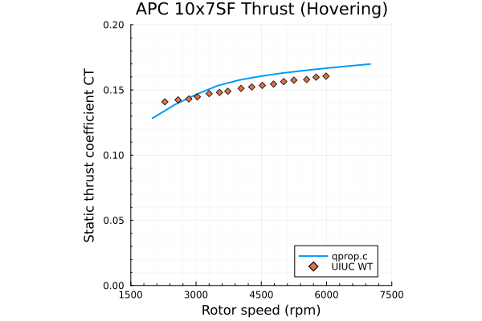 | 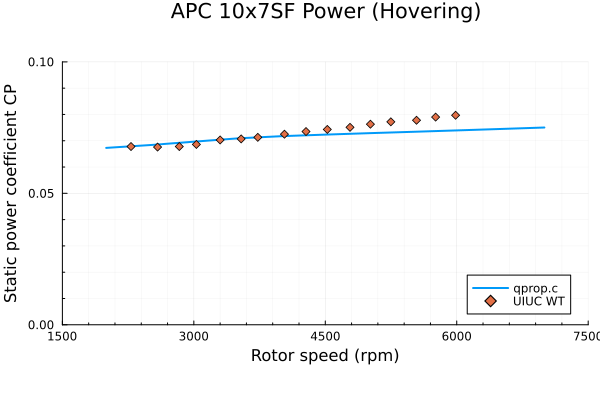 | 
:-------------------------------------------------------:|:------------------------------------------------------:|:------
 | 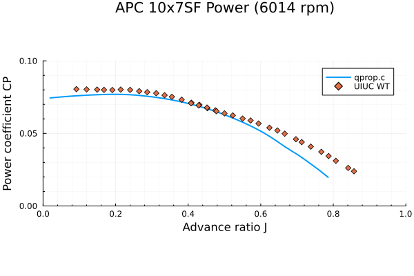 | 

<!--

-->

The results shows very good accuracy in all scenarios, especially considering
that qprop.c is a cheap low-fidelity code.

Credits:
* Wind tunnel data (`uiuc_data/*.*`) downloaded from the UIUC Propeller Database [1]
* Geometry data (`10x7SF-PERF.PE0`) downloaded from the APC website [2]

## Graupner 6x3

The qprop.c implementation was validated against the original QPROP v1.22
developed by Drela, using the Graupner 6x3 propeller as the default example.
Two cases were examined: hovering (Uinf=0.01m/s) and cruise (Uinf=5.0m/s).

All tests were run on an x86-64 PC with Ubuntu 24.04.1 LTS.
The hovering case was run in Julia 1.11.2,
while the cruise case was run in Python 3.12.3.
The C compiler used to build the shared libraries was zig-linux-x86_64-0.14.0-dev.2851+b074fb7dd.

These validation scripts also serve as examples of how to use qprop.c without
detailed airfoil polars, reproducing the analytic polar model used in QPROP.

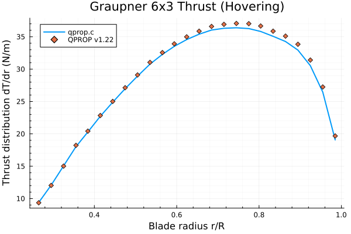 | 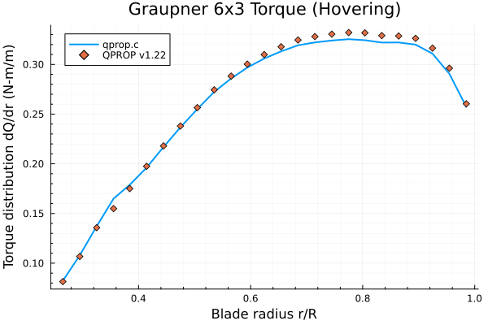
:-----------------------------------------------------------------:|:-----------------------------------------------------------------:
   | 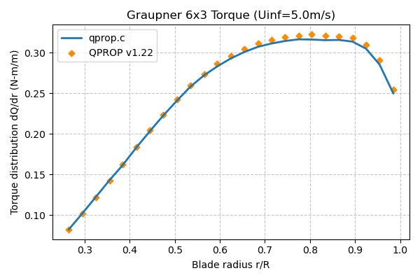

<!--

-->

The results show general consistency with the original QPROP v1.22,
but some small yet non-negligible differences were observed.
These differences are expected due to the fundamentally different implementation
approach taken in qprop.c, specifically the use of a different root-finding
algorithm and the handling of compressibility effects.

Credits:
* Definition files (`*.def`) adapted from the QPROP v1.22 examples [3]

## APC 16x8E

This test case is similar to the previous APC 10x7SF, sharing the same setup.
However, the APC 16x8E rotor is larger and features slender blades,
a configuration that comfortably falls within the code's assumptions.

<!--

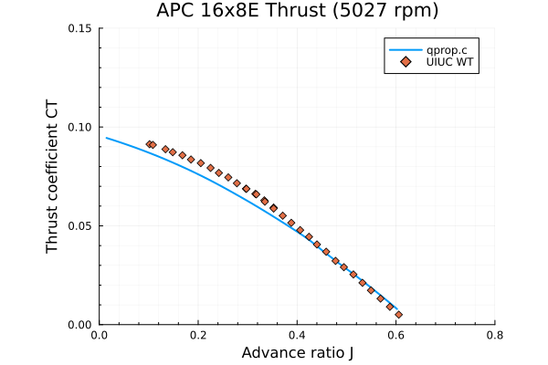
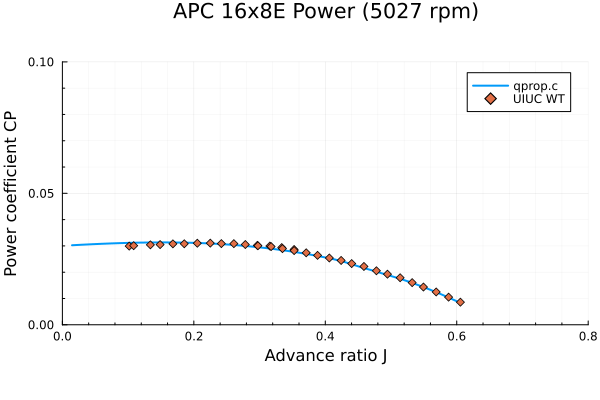
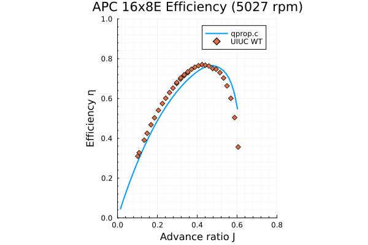
-->

 |  | 
:-------------------------------------------------------:|:------------------------------------------------------:|:------
 |  | 

As expected, qprop.c shows good agreement with the experimental results.

Credits:
* Wind tunnel data (`uiuc_data/*.*`) downloaded from the UIUC Propeller Database [1]
* Geometry data (`16x8E-PERF.PE0`) downloaded from the APC website [2]

## APC 4.2x4

The APC 4.2x4 rotor was used as a test case to assess the behavior of qprop.c at
the boundaries of its theoretical validity.
This small rotor features non-slender blades and operates at high RPMs,
resulting in significant 3D effects that challenge the code's assumptions.

<!--
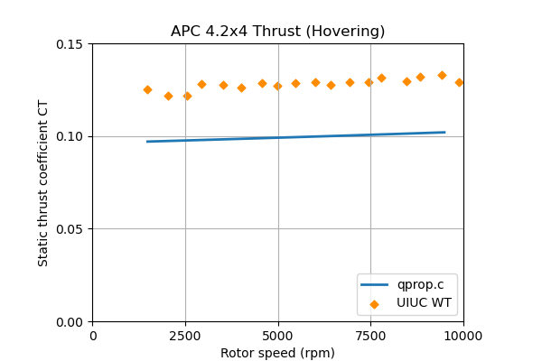
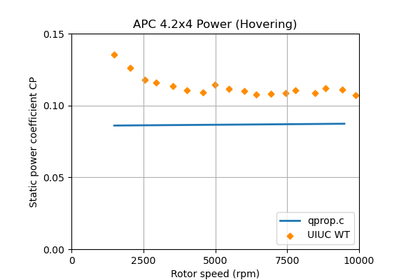

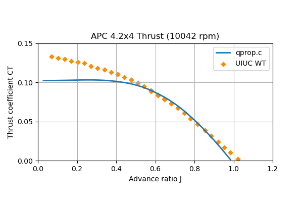
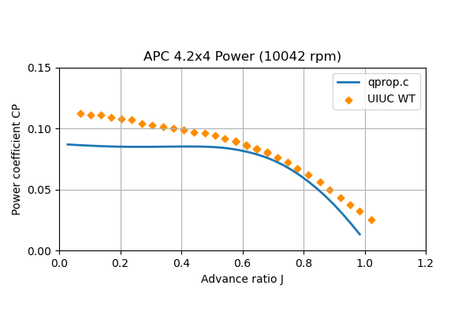
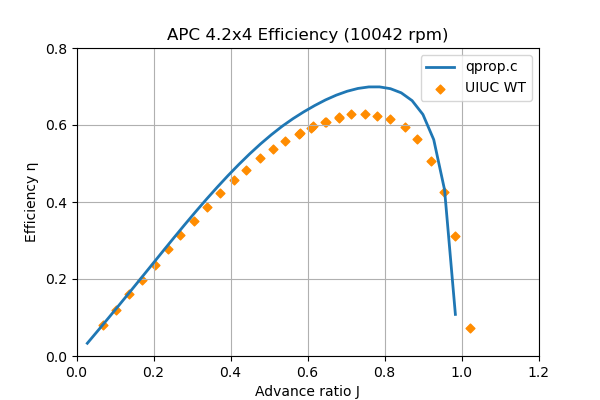
-->
 |  | 
:-------------------------------------------------------:|:------------------------------------------------------:|:------
 |  | 

While some discrepancies were expected, the results from qprop.c deviated
excessively from the wind tunnel data in hovering conditions.
The performance of qprop.c was further evaluated in the entire operating diagram.

In freestream conditions, the discrepancies between qprop.c and wind tunnel data
are more reasonable, aligning with expectations for a challenging case.
However, the significant issues in hovering conditions indicates that the stall
model requires improvement.
This limitation will be addressed in future versions of the code.

Credits:
* Wind tunnel data (`uiuc_data/*.*`) downloaded from the UIUC Propeller Database [1]
* Geometry data (`42x4-PERF.PE0`) downloaded from the APC website [2]

## References

[1] J.B. Brandt, R.W. Deters, G.K. Ananda, O.D. Dantsker, and M.S. Selig (2025/01/05),
    UIUC Propeller Database, Vols 1-4, University of Illinois at Urbana-Champaign, Department of
    Aerospace Engineering, retrieved from https://m-selig.ae.illinois.edu/props/propDB.html

[2] APC Propellers, "[Propeller Geometry Data](https://www.apcprop.com/technical-information/file-downloads/)", Online

[3] M. Drela, [QPROP User Manual](https://web.mit.edu/drela/Public/web/qprop/), Online
